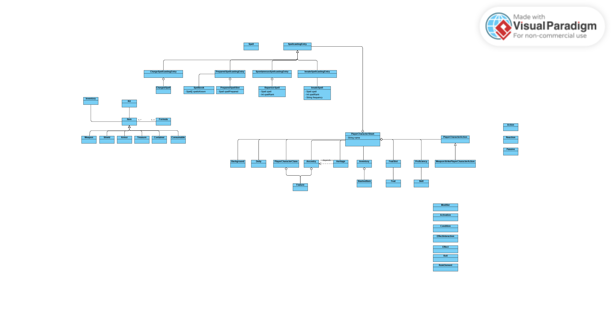

# Projeto GRATHO

## Compilador 

## Build

```cmd
cmake . -B build
cmkae --build build
```

## Executáveis

```cmd
build/main_app.exe
```

## Debug mode

As tasks e 

## Estrutura do projeto

Este projeto é uma casca para desevolver uma lib em C++.
Aqui está uma propsota para estrutura do projeto estrutura:

```
person_lib/
├── include/              
│   └── characters/       
│       ├── Person.h      
├── src/                  
│   └── characters/       
│       ├── Person.cpp    
│   └── main.cpp          
├── CMakeLists.txt        
└── README.md             
```

## Classes

